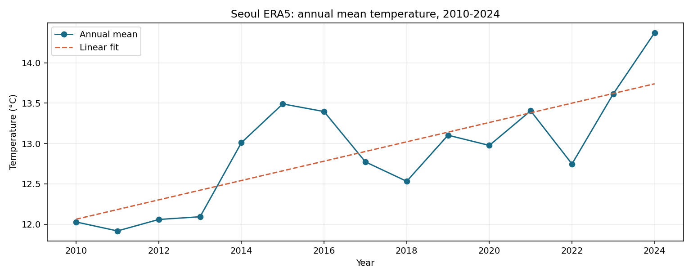
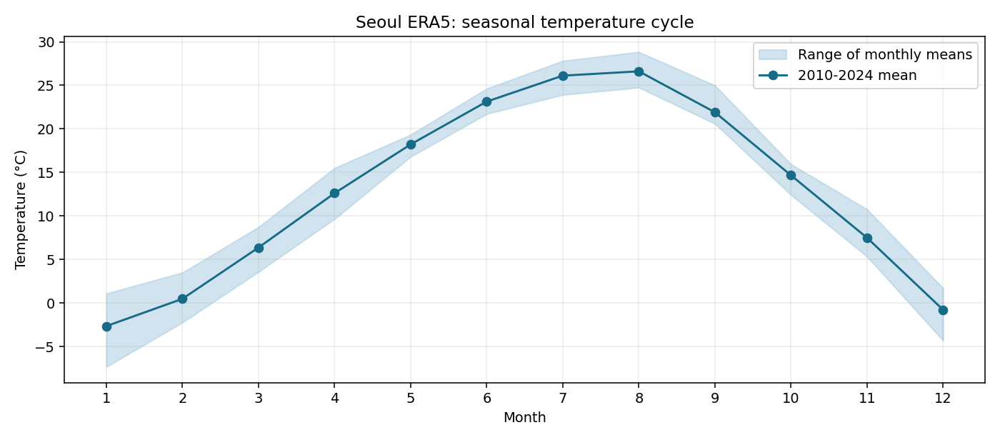
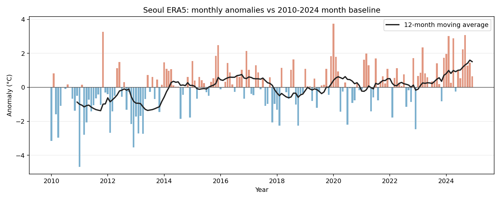

# 서울 월평균 기온 시계열 분석 (2010~2024)

## 1. 주제와 질문

서울 중심부의 ERA5 격자 일평균 2m 기온을 월별로 집계해, 계절 변동 속에서 장기 변화를 읽을 수 있는지 살펴보았다.

1. 2010~2024년 연평균 기온은 어떻게 변했는가?
2. 월별 계절 패턴은 얼마나 큰가?
3. 계절성을 제거했을 때 유난히 따뜻하거나 추운 달은 언제인가?
4. 12개월 이동평균으로 볼 때 단기 변동을 걷어낸 흐름은 어떤가?

## 2. 데이터와 정제

- 출처: [Open-Meteo Historical Weather API](https://open-meteo.com/en/docs/historical-weather-api), 모델 `era5`, 변수 `temperature_2m_mean`(°C). 요청 좌표 37.5665°N, 126.9780°E; 반환 격자 37.5°N, 127.0°E.
- 기간: 2010-01-01~2024-12-31, Asia/Seoul 기준 일별 5,479개 → 월평균 180개. 원본 `data/seoul_era5_daily_2010_2024.json`.
- 컬럼: 원본 `time`, `temperature_2m_mean`; 가공 자료 `date`, `temp_c`, `month`, `year`, `climatology_c`, `anomaly_c`, `ma12_c`, `anomaly_ma12_c`.
- 품질 검사: 날짜 중복·누락 0일, 기온 결측 0개. 결측 대체는 하지 않았다. 단위 오류·결측 코드 탐지를 위해 일평균 기온 -40~45°C 범위를 벗어나면 실행을 중단하도록 했으며, 실제 최솟값 -15.5°C·최댓값 32.3°C는 범위 안이다. 이 범위는 물리적 점검용이지 통계적 이상치 판정 기준이 아니다. 큰 편차는 실제 기상 현상일 수 있어 임의 삭제하지 않았다.
- 집계: 하루 평균 기온의 산술평균을 달별 기온으로 사용했다. 달마다 일수가 달라 연평균은 모든 일평균에 같은 가중치를 주어 계산했다.
- 방법: 연평균과 선형 추세, 월별 15년 평균(계절성), 각 달의 평균 대비 편차, 12개월 이동평균을 적용했다. 편차는 해당 월의 2010~2024년 평균을 빼서 계산했다.

## 3. 시각화와 인사이트

### 연평균 추세

**관찰:** 첫 5년(2010~2014) 연평균의 평균은 12.22°C, 마지막 5년(2020~2024)은 13.42°C로 1.20°C 높았다. 연평균에 적합한 직선의 기울기는 약 1.20°C/10년이다. 2011년은 11.92°C로 기간 내 최저, 2024년은 14.37°C로 최고다.

**해석:** 이 자료와 기간에서는 온난한 방향의 변화가 보인다. 다만 15년 단일 격자 추세를 서울 전체의 장기 기후 변화율이나 원인으로 일반화할 수 없다. 더 긴 기간과 관측소 자료로 비교해야 한다.

### 월별 계절성

**관찰:** 15년 월별 평균에서 1월이 -2.66°C로 가장 낮고 8월이 26.61°C로 가장 높다. 두 달의 차이는 29.27°C다.

**해석:** 계절 변동 폭이 연도 간 상승폭보다 크므로 원시 월별 그래프만으로 연도 간 변화를 판단하기 어렵다. 같은 달끼리 비교하거나 계절성을 제거한 편차를 함께 보는 것이 적절하다.

### 계절성 제거 편차와 이동평균

**관찰:** 2010~2024년 해당 월 평균 대비 가장 큰 양의 편차는 2020년 1월 +3.75°C, 가장 큰 음의 편차는 2011년 1월 -4.68°C다. 검은 선은 월별 편차의 12개월 이동평균이며 처음 11개월은 계산할 수 없어 표시되지 않는다.

**해석:** 특정 달의 큰 편차는 단기 기상 변동을 보여준다. 한 달만으로 지속적 추세나 원인을 판단할 수 없으므로 연평균과 이동평균을 함께 확인한다. 이 그래프만으로 어떤 기상 현상이 편차를 만들었는지는 알 수 없다.

## 4. 결론과 한계

이 180개월 자료에서 계절성이 뚜렷하고, 2010년대 초반보다 2020년대 초반의 연평균이 높았다. 실무적으로는 원시 월별 값만 비교하지 말고, 같은 달 기준 편차와 연평균을 함께 확인하는 것이 좋다.

ERA5는 관측과 모델을 결합한 **재분석 격자 자료**이며 기상청 서울 관측소 실측값이 아니다. 격자 위치와 지형 표현에 따른 차이가 있을 수 있다. 분석 기간이 15년으로 기후 평년(통상 30년)보다 짧고, 기준 월평균도 이 분석 기간 안에서 계산했다. 선형 추세는 기술적 요약이며 통계적 유의성이나 인과관계를 검증하지 않았다. 온실가스, 도시화, 해양 변동 등의 외부 요인은 분석하지 않았다.

## 5. 출처와 이용 조건

자료 제공: [Open-Meteo Historical Weather API](https://open-meteo.com/en/docs/historical-weather-api), ERA5. API 데이터는 [CC BY 4.0](https://creativecommons.org/licenses/by/4.0/)으로 제공된다. 출처와 라이선스를 표시하고, 이 프로젝트에서 일별 자료를 월평균·편차·그래프로 가공했음을 명시한다. 무료 API는 비상업 용도이며 다른 용도에서는 [서비스 이용 조건](https://open-meteo.com/en/terms)을 확인해야 한다. 모델 자료는 갱신될 수 있으므로 재수집 결과가 저장된 원본과 달라질 수 있다.

## 6. AI 사용 로그

| 사용 작업 | 사용 이유 | 검증 방법 |
|---|---|---|
| 자료원·이용 조건 조사, 분석 질문 설계 | 출처가 명확한 자료 선택 | 공식 API 문서·라이선스·응답 메타데이터 대조 |
| Python 전처리·그래프 코드 작성 | 반복 가능한 분석 자동화 | 전체 날짜 5,479개와 월별 180개, 결측 0개를 스크립트에서 검사하고 실제 실행 |
| 수치 요약·문장 작성 | 관찰과 해석의 구분 | `data/metrics.json` 출력과 그래프를 대조하고 과도한 인과 해석을 제외 |

실행 명령과 원본 자료 재수집 방법은 [README.md](README.md)에 있다.
